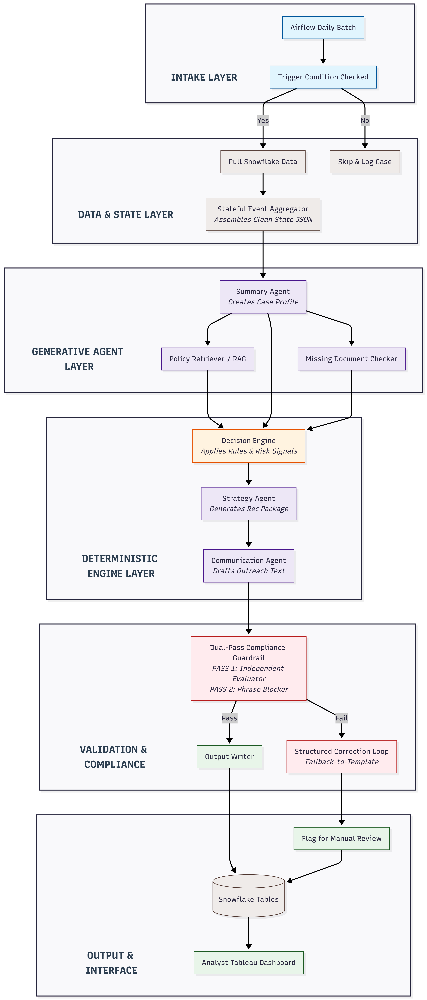

# Where AI Agents Actually Fit in Regulated Workflows
> **Not as decision-makers, but as governed copilots for policy-heavy, human-reviewed operations.**

## 📖 Full Writeup
A detailed breakdown of the system architecture and business tradeoffs 
is available on Substack:👉 [

Some workflows look simple from the outside.
* A customer files an insurance claim.
* A borrower asks for loan hardship assistance.
* A patient needs medical prior authorization.
* A compliance team reviews an internal control.
* A fraud alert lands in an analyst's queue.
* A contract needs corporate legal review.

At first glance, these sound like normal, repeatable back-office operations. But inside the workflow, things get complicated quickly. 

The human reviewer must pull together fragmented data from legacy systems, read shifting policy documents, check rigid eligibility rules, interpret risk scores, identify missing documentation, follow strict communication guidelines, and leave behind a flawless audit trail. Because the final outcome is sensitive, highly regulated, and financially meaningful, the organization cannot simply say:

> **“Let the LLM decide.”**

**That is the wrong framing.** The better question is: *“How can an AI agent help a human make a better, faster, more consistent, and more auditable decision?”*

That is where agentic AI becomes revolutionary. **Not as an autonomous decision-maker, but as a governed workflow copilot.**

---

## The Wrong Design: LLM as the Decision-Maker

The tempting design for teams rushing a proof-of-concept to production is linear:

```
Case Details ──► Large Language Model ──► Final Decision
```

This is an extraordinary risk. In regulated workflows, decisions must follow approved policies, immutable business rules, and legal constraints. If an LLM misses a subtle exception clause, fabricates a compliance policy, or gives inconsistent guidance across two identical cases, the issue isn't just a "bad user experience." **It is a catastrophic compliance, legal, and financial liability.**

> **The first principle of enterprise AI system design is absolute: The LLM must never be the system of record for a decision.**


The LLM can summarize data. It can retrieve context. It can explain complexity. It can draft communication pipelines. **But the governed decision must come from approved rules, structured engines, deterministic models, and accountable humans.**

---

## The Better Design: Governed Decision Support

A production-grade architecture completely separates responsibilities:
* **Structured Data** tells us *what happened*.
* **Policy Retrieval** tells us *what rules apply*.
* **Decision Engines** tell us *what is mathematically allowed*.
* **LLM Agents** *translate logic into language* (summarizing, explaining, drafting).
* **Humans** review, validate, and sign off.

To make this architecture concrete, let's look at the two distinct operational execution modes required to run an enterprise operations desk: **Proactive Automation (The Daily Batch Trigger)** and **Reactive Exploration (The Analyst Chat Interface)**.

### 1. The Proactive Automation Pipeline (Daily Batch)

The batch workflow is designed to automatically handle massive queues of cases running on automated orchestrators like Apache Airflow. Instead of making the LLM read raw, unorganized databases at runtime, the data is progressively filtered through a deterministic rules engine before the generative layer ever touches it.

```

```

### 2. The Reactive Exploration Pipeline (Analyst Chat)

When an operations analyst needs to dynamically drill down into a specific case, audit a particular rule, or query a corporate policy manual, running a heavy, end-to-end processing pipeline is incredibly inefficient. 

Instead, a **Router Agent** short-circuits the workflow based entirely on the analyst's structural intent—**completely bypassing unnecessary data layers to deliver instantaneous answers.**

This router design is what makes the system truly "agentic" in a commercial sense. **The system architecture dynamically restructures its underlying components based entirely on the task at hand.** If the analyst asks: *"What documents are missing for this account?"*, the Router short-circuits straight to the data layer and document checker tools, completely ignoring the complex compliance or drafting models.


---

## RAG, Rules, Models, and LLMs: Who Does What?

Decoupling logic from language requires establishing explicit boundaries for every asset in your infrastructure stack:

| Component | Technical Role in the Pipeline |
| :--- | :--- |
| **Structured Data Tools** | Pull historical cases, transactional records, and user context directly from data warehouses (e.g., Snowflake). |
| **Policy Retrieval (RAG)** | Fetches specific, vetted clauses of regulatory playbooks, compliance guidelines, or legal briefs at runtime. |
| **Decision Engine** | Evaluates immutable, deterministic mathematical eligibility and business rules. The heart of the system. |
| **Machine Learning Models** | Computes statistical inferences (e.g., default probabilities, fraud risk matrices, or risk parameters). |
| **LLM Agents** | Act as translators. They summarize records, synthesize tool outputs, and frame calculations into plain human language. |
| **Validators** | Provide a rigid check on structural schemas, text alignment, and prohibited phrase parameters. |
| **Human Reviewer** | Maintains final accountability; reviews, signs off, and triggers system writeback actions. |

Because the knowledge base in regulated operations constantly shifts (e.g., state rules change, compliance definitions update, communication templates adjust), **RAG is the mandatory choice over model fine-tuning for policy grounding.** RAG allows the model to fetch and cite the absolute latest approved text section at runtime, leaving a clear paper trail. 

> **A simple rule of thumb: If the knowledge changes and needs citations, use RAG. If the behavior is stable and repeated, consider fine-tuning.**

---

## Production Design Choices: Deep-Dive Q&A

When moving this blueprint from a local sandbox to a production-scale enterprise data cluster, systems engineers encounter specific architectural edge cases. Here is how this design safely mitigates them.

### Q1: Why use an asynchronous "Stateful Event Aggregator" instead of allowing the Summary Agent to read raw data logs directly at runtime?

**The Trade-off: Processing Complexity vs. Operational Overhead**

In an active enterprise system, a single case file contains a massive data footprint: years of structured tabular transactions, thousands of lines of conversational notes input by human operators over time, and uploaded PDF document packages. 

Dumping this raw data directly into an LLM context window at runtime causes immediate production failures: it blows out the token context window, inflates API bills exponentially, and causes massive latency spikes (often exceeding 20 seconds). Furthermore, LLMs suffer from the **“Lost in the Middle” phenomenon**—failing to capture crucial exceptions when buried under dense walls of text.

**The Solution:** The architecture introduces an asynchronous **Stateful Event Aggregator**. As new account events or notes occur, lightweight background scripts incrementally process the data and update a highly condensed, centralized **State JSON** profile document. **When the batch orchestrator fires, the Summary Agent reads a compact, structured timeline rather than a disorganized data swamp, dropping token overhead, slashing latency, and guaranteeing no critical exception variables are missed.**

### Q2: Why isolate validation into a single, external "Dual-Pass Compliance Guardrail" block rather than handling checks natively inside individual agent prompts?

**The Trade-off: Decoupled Independent Safety vs. Inline Instruction Reliance**

Tasks like checking text alignment against structured inputs or blocking prohibited phrases should never be handled via inline prompt engineering. Tasking a model with both creating content and auditing its own output splits its attention layers, leaving it **highly vulnerable to instruction drift, prompt injections, and subtle hallucinations.**

**The Solution:** We completely decouple verification by placing a dedicated **Dual-Pass Compliance Guardrail** box entirely outside the generative layer:
* **PASS 1 (The Independent Evaluator):** A highly restricted model that consumes *only* the raw, deterministic outputs of the quantitative Decision Engine and the generated text draft. It acts as an independent judge, validating whether the textual claims exactly match the mathematical logic calculated by the underlying rules engine.
* **PASS 2 (The Deterministic Phrase Blocker):** A non-probabilistic software module that relies entirely on traditional, high-speed regex tables to scan for legally hazardous language or structural modifications of approved corporate templates.

### Q3: What happens when a generated asset fails the Compliance Guardrail? How does the architecture prevent a human operational deadlock?

**The Trade-off: Uncompromising Enterprise Safety vs. Flow Throughput**

If an architectural security layer simply throws a generic hard stop error or a broken screen when a compliance check fails, it introduces an operational bottleneck. **The human analyst is left hanging, forced to manually type out calculations from scratch—completely erasing the efficiency gains built by the automation layer.**

**The Solution:** The pipeline utilizes a structured **Correction Loop with a Fallback-to-Template** trigger. If Pass 1 or Pass 2 flags an issue, the system automatically routes the error logs back through a correction loop, giving the agent up to two chances to self-correct the text draft. 

If the generation still fails validation, the probabilistic engine terminates entirely. **The pipeline instantly swaps out the generative model and falls back onto a completely static, deterministic, token-swapped Legal Template hardcoded inside the system repo.** The failure is quietly logged for prompt optimization, but the analyst’s workflow never freezes—they receive a pristine, compliant asset, allowing the human-in-the-loop operation to proceed without a second of downtime.

---

## Why this Pattern Applies Beyond Lending

While a borrower hardship case serves as an excellent reference model, this identical data assembly line scales across every major corporate operation desk:

* **Insurance Claims:** `Claim Telemetry` $
ightarrow$ `Coverage Policy Retrieval` $
ightarrow$ `Rules Engine/Fraud Model` $
ightarrow$ `LLM Explanation Generation` $
ightarrow$ `Adjuster Review`
* **Healthcare Prior Authorization:** `Patient Diagnostics` $
ightarrow$ `Clinical Guidelines Fetch` $
ightarrow$ `Medical Necessity Rules` $
ightarrow$ `LLM Medical Case Summary` $
ightarrow$ `MD Review`
* **Fraud Operations:** `Alert Activity Telemetry` $
ightarrow$ `Fraud Playbook Retrieval` $
ightarrow$ `Risk Score Models` $
ightarrow$ `LLM Case Narrative Generation` $
ightarrow$ `Analyst Sign-off`

**The domain changes, but the core engineering paradigm stays completely intact:**

```
Complex Case ──► Relevant Policy ──► Governed Checks ──► LLM Explanation/Drafting ──► Human Approval ──► Audit Trail
```

---

## Final Takeaway

The future of AI agents in enterprise-scale operations is not fully autonomous decisioning. **It is governed, auditable, human-in-the-loop decision support.** The most valuable enterprise systems built today will not ask: *“Can we get the LLM to make the right decision?”* They will ask: 

> **“Can we construct an architecture where the LLM helps the human understand the case, applies the right deterministic policy, communicates flawlessly, and leaves behind an ironclad audit trail?”**

That is where AI agents actually fit.
